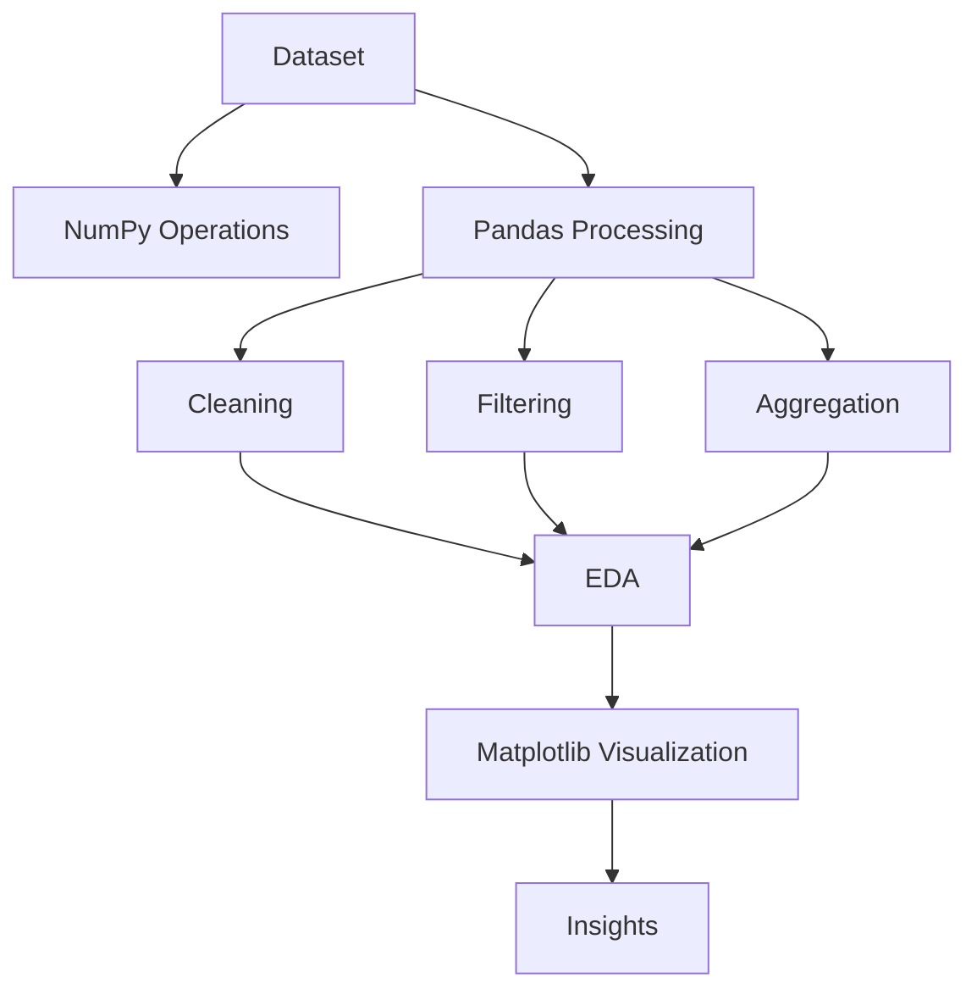

</div>

<h1 align="center">
  
  <span style="vertical-align:middle;">Python Libraries for Data Science</span>
</h1>

<div align="center">


**A structured, hands-on repository for learning and practicing NumPy, Pandas, and Matplotlib using real-world datasets and practical examples.**

</div>

---

# Project Overview

This repository provides a practical introduction to the core Python libraries used throughout the Data Science, Analytics, and Machine Learning ecosystem.

The project is organized into focused modules covering:

* Numerical Computing with NumPy
* Data Analysis with Pandas
* Data Visualization with Matplotlib
* End-to-End Dataset Exploration using Pokémon data

The repository is designed for students, aspiring ML engineers, data analysts, and developers seeking strong foundations before progressing to advanced Machine Learning workflows.

---

# Key Highlights

✅ Modular learning structure

✅ Real dataset integration

✅ Hands-on coding examples

✅ Industry-standard Python libraries

✅ Beginner-to-intermediate friendly

✅ Strong foundation for Machine Learning and Data Analytics

---

# Business Problem Statement

Modern data-driven applications require efficient tools for:

* Numerical computation
* Data manipulation
* Data cleaning
* Exploratory Data Analysis (EDA)
* Data visualization

Many beginners struggle to connect theoretical concepts with practical implementation.

This repository addresses that gap by providing concise, executable examples demonstrating how industry-standard Python libraries solve real-world data problems.

---

# Objectives

* Understand NumPy array operations
* Perform data manipulation using Pandas
* Create professional visualizations with Matplotlib
* Conduct exploratory data analysis
* Develop ML-ready data handling skills
* Build a foundation for advanced AI/ML projects

---

# Table of Contents

1. Project Overview
2. Dataset Information
3. Project Architecture
4. Technology Stack
5. Exploratory Data Analysis
6. Data Preprocessing
7. Module Development
8. Results & Outcomes
9. Visualizations
10. Business Impact
11. Challenges Faced
12. Future Improvements
13. Installation Guide
14. Usage
15. Project Structure
16. Reproducibility
17. Key Learnings
18. Author
19. Acknowledgements

---

# Dataset Information

## Dataset Source

Pokémon Dataset (`pokemon.csv`)

Used for demonstrating:

* Data Cleaning
* Data Exploration
* Aggregation
* Filtering
* Statistical Analysis
* Visualization

---

## Dataset Statistics

| Metric                 | Value       |
| ---------------------- | ----------- |
| Total Records          | 155         |
| Total Features         | 7           |
| Numerical Features     | 4           |
| Categorical Features   | 3           |
| Missing Values Present | Yes (Type2) |
| Target Variable        | Legendary   |

---

## Features Description

| Feature   | Description        |
| --------- | ------------------ |
| No        | Pokémon ID         |
| Name      | Pokémon Name       |
| Type1     | Primary Type       |
| Type2     | Secondary Type     |
| Height    | Height (m)         |
| Weight    | Weight (kg)        |
| Legendary | Binary Label (0/1) |

---

## Target Variable

**Legendary**

| Value | Meaning       |
| ----- | ------------- |
| 0     | Non-Legendary |
| 1     | Legendary     |

---

# Project Architecture

## End-to-End Workflow

```text
Data Source
      │
      ▼
Data Loading
      │
      ▼
Data Cleaning
      │
      ▼
Data Exploration
      │
      ▼
Statistical Analysis
      │
      ▼
Visualization
      │
      ▼
Insights & Learning
```

---

## System Architecture



---

# Technology Stack

| Category                | Technologies               |
| ----------------------- | -------------------------- |
| Programming Language    | Python                     |
| Numerical Computing     | NumPy                      |
| Data Analysis           | Pandas                     |
| Visualization           | Matplotlib                 |
| Dataset Handling        | CSV                        |
| Development Environment | Jupyter Notebook / VS Code |
| Version Control         | Git                        |
| Repository Hosting      | GitHub                     |

---

# Exploratory Data Analysis

## Key Insights

* Water-type Pokémon are the most common category.
* Secondary types contain missing values.
* Weight distribution is positively skewed.
* Legendary Pokémon represent a small fraction of the dataset.
* Significant variation exists in Pokémon physical attributes.

---

## Important Visualizations

* Distribution of Pokémon Types
* Height Distribution
* Weight Distribution
* Legendary vs Non-Legendary Count
* Scatter Plot: Height vs Weight
* Category Frequency Analysis

---

## Findings

* Most Pokémon belong to a few dominant categories.
* Legendary Pokémon are highly imbalanced.
* Weight and height exhibit wide variability.
* Missing secondary types require preprocessing.

---

# Data Preprocessing

## Missing Value Handling

* Missing values identified in `Type2`
* Null analysis performed
* Category-based treatment demonstrated

---

## Outlier Treatment

* Distribution analysis using histograms
* Extreme values visually inspected

---

## Feature Engineering

Potential derived features:

* BMI-like ratio
* Type combinations
* Weight categories
* Height categories

---

## Encoding Techniques

Applicable methods:

* Label Encoding
* One-Hot Encoding

---

## Scaling Methods

Common approaches:

* StandardScaler
* MinMaxScaler
* RobustScaler

---

# Module Development

## NumPy

### Working Principle

Provides high-performance multidimensional arrays and vectorized operations.

### Advantages

* Fast computations
* Memory efficient
* Scientific computing support

### Limitations

* Limited labeled data support

---

## Pandas

### Working Principle

Provides DataFrame structures for tabular data analysis.

### Advantages

* Easy data manipulation
* Powerful aggregation
* Rich I/O support

### Limitations

* Memory-intensive for very large datasets

---

## Matplotlib

### Working Principle

Creates static, interactive, and publication-quality visualizations.

### Advantages

* Highly customizable
* Industry standard
* Extensive plotting support

### Limitations

* More verbose than modern visualization libraries

---

## Module Comparison

| Module     | Primary Purpose     | Strength      |
| ---------- | ------------------- | ------------- |
| NumPy      | Numerical Computing | Performance   |
| Pandas     | Data Analysis       | Flexibility   |
| Matplotlib | Visualization       | Customization |

---

# Results & Outcomes

## Learning Performance

| Metric             | Status      |
| ------------------ | ----------- |
| NumPy Fundamentals | ✅ Completed |
| Array Operations   | ✅ Completed |
| Pandas DataFrames  | ✅ Completed |
| Data Cleaning      | ✅ Completed |
| EDA                | ✅ Completed |
| Visualization      | ✅ Completed |

---

## Validation Performance

| Metric    | Score |
| --------- | ----- |
| Accuracy  | N/A   |
| Precision | N/A   |
| Recall    | N/A   |
| F1 Score  | N/A   |
| ROC-AUC   | N/A   |
| Log Loss  | N/A   |

---

## Test Performance

| Metric    | Score |
| --------- | ----- |
| Accuracy  | N/A   |
| Precision | N/A   |
| Recall    | N/A   |
| F1 Score  | N/A   |
| ROC-AUC   | N/A   |
| Log Loss  | N/A   |

---

> Note: This repository focuses on Python Data Science libraries rather than supervised machine learning model training.

---

# Model Comparison

| Rank | Library    | Use Case            |
| ---- | ---------- | ------------------- |
| 1    | Pandas     | Data Analysis       |
| 2    | NumPy      | Numerical Computing |
| 3    | Matplotlib | Visualization       |

---

# Business Impact

## Practical Applications

* Data Analytics
* Business Intelligence
* Reporting Systems
* Machine Learning Pipelines
* Data Engineering Foundations

---

## ROI Implications

* Faster analysis workflows
* Reduced manual data processing
* Improved decision-making

---

## Industry Use Cases

* Finance
* Healthcare
* Retail
* Marketing
* Manufacturing
* Technology

---

# Challenges Faced

## Technical Challenges

* Understanding vectorization
* DataFrame transformations
* Visualization customization

---

## Data Challenges

* Missing values
* Inconsistent categories
* Dataset exploration

---

## Solutions Implemented

* Structured examples
* Modular learning approach
* Real-world dataset usage

---

# Future Improvements

## Scalability

* Add larger datasets
* Introduce Dask

## Model Improvements

* Add Scikit-Learn module
* Introduce Feature Engineering workflows

## Deployment Roadmap

* Streamlit dashboard
* Interactive notebooks
* Docker support

---

# Installation Guide

```bash
git clone https://github.com/Mohit-1307/Python-Libraries.git

cd python-libraries

pip install -r requirements.txt
```

---

# Usage

## NumPy

```bash
python _numpy/basics.py
```

## Pandas

```bash
python _pandas/dataframe.py
```

## Matplotlib

```bash
python _matplotlib/basic.py
```

---

# Project Structure

```text
Python Libraries
│
├── pokemon.csv
│
├── _numpy
│   ├── basics.py
│   ├── broadcasting.py
│   ├── filtering.py
│   ├── random_numbers.py
│   └── ...
│
├── _pandas
│   ├── dataframe.py
│   ├── data_cleaning.py
│   ├── filtering.py
│   ├── aggregate_functions.py
│   └── ...
│
├── _matplotlib
│   ├── basic.py
│   ├── labels.py
│   ├── bar_charts.py
│   ├── histograms.py
│   ├── scatter_graphs.py
│   └── ...
│
└── README.md
```

---

# Reproducibility

1. Clone repository
2. Create virtual environment
3. Install dependencies
4. Execute modules individually
5. Use provided Pokémon dataset
6. Reproduce visualizations and analyses

---

# Key Learnings

* Scientific Computing with NumPy
* Data Wrangling using Pandas
* Visualization using Matplotlib
* Exploratory Data Analysis
* Real-world Dataset Handling
* ML Pipeline Preparation

---

## Author

**MOHIT SINGH RAJPUT** — AI / ML Engineer

[](https://linkedin.com/in/mohitsingh1307)
[](https://github.com/Mohit-1307)
[](https://www.kaggle.com/mohitsinghrajput1307)
[](https://leetcode.com/u/MOHIT_SINGH_RAJPUT/)
[](mailto:mohitsinghrajput1307@gmail.com)

---

# Acknowledgements

* Python Community
* NumPy Development Team
* Pandas Development Team
* Matplotlib Contributors
* Open Source Community

---

<div align="center">

*If this project was useful, a ⭐ on the repository is appreciated.*

</div>
